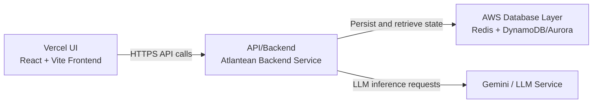

<div align="center">

</div>

# Run and deploy your AI Studio app

This contains everything you need to run your app locally.

View your app in AI Studio: https://ai.studio/apps/drive/12CDszUJAxwc5CBTjwFTX8IKXHZUgE5LY

## H0 Submission Fit

This repository includes the core H0 delivery requirements requested in this workspace:

- Frontend deployment config for Vercel via [vercel.json](vercel.json)
- Dedicated Vercel deployment guide with Preview vs Production copy-paste settings in [VERCEL_DEPLOYMENT.md](VERCEL_DEPLOYMENT.md)
- Optional AWS database integration (DynamoDB and Aurora Data API) in [atlantean_core/aws_persistence.py](atlantean_core/aws_persistence.py)
- AWS environment template variables in [.env.example](.env.example)
- Aurora table schema matching configured table names in [db/aurora_tables.sql](db/aurora_tables.sql)
- One-command script to apply Aurora schema through RDS Data API in [scripts/apply_aurora_schema.sh](scripts/apply_aurora_schema.sh)

## Architecture Diagram



## Run Locally

**Prerequisites:**  Node.js


1. Install dependencies:
   `npm install`
2. Set `VITE_GEMINI_API_KEY` in [.env.local](.env.local) to your Gemini API key
3. Run the app:
   `npm run dev`

## Deploy On Vercel (Frontend)

Detailed guide with Preview vs Production copy-paste settings: [VERCEL_DEPLOYMENT.md](VERCEL_DEPLOYMENT.md)

This repository uses a Vite frontend and a separate Atlantean backend service.
The Vercel deployment should host the frontend only, while backend calls go to your deployed backend URL.

1. Deploy the Atlantean backend first (for example on Render, Fly.io, Railway, or your own VM).
2. In your backend environment, set `ALLOWED_ORIGINS` to include your Vercel domain.
3. In Vercel, import this repository as a new project.
4. Use these project settings (already aligned with `vercel.json`):
   - Build Command: `npm run build`
   - Output Directory: `dist`
5. Add frontend environment variables in Vercel Project Settings -> Environment Variables:
   - `VITE_ATLANTEAN_API_BASE=https://YOUR_BACKEND_DOMAIN/api/atlantean`
   - `VITE_ATLANTEAN_HEALTH_URL=https://YOUR_BACKEND_DOMAIN/health`
6. Deploy.

After deploy, the frontend is served by Vercel and all Atlantean API traffic goes directly to your backend domain.

### Vercel Notes

- `vercel.json` includes SPA fallback routing to `index.html`.
- If you later move your backend into Vercel serverless functions, update the two `VITE_...` variables to same-origin paths.
- If you see `500 FUNCTION_INVOCATION_FAILED` on Vercel, verify `VITE_ATLANTEAN_API_BASE` is set for both Preview and Production and redeploy.

## Validation And Benchmarks

Run the full validation suite:

```bash
python tests/run_validation.py
```

Includes:
- HRM simulation tests
- Hot/cold memory persistence tests
- Sync conflict tests
- Stateless LLM enforcement tests

Run CPU batch training benchmark for HRM:

```bash
python benchmarks/hrm_cpu_batch_benchmark.py --batch-size 16 --steps 100 --epochs 3
```

## QUADRA Symbolic Governance Modules

New modules in `atlantean_core`:
- `symbolic_reasoner.py`
- `governance.py`
- `scheduler.py`

These modules are compute-gated and optional by design. They do not run continuously.

### Compute-Gating Controls

Set environment variables to enable and bound optional symbolic reasoning:

```bash
export QUADRA_SYMBOLIC_ENABLED=1
export QUADRA_SYMBOLIC_EVERY_N_QUERIES=25
export QUADRA_SYMBOLIC_MAX_COMPUTE_MS=6.0
export QUADRA_SYMBOLIC_BUDGET_MS_PER_MIN=120.0
export QUADRA_GOVERNANCE_WINDOW_SECONDS=60
export QUADRA_GOVERNANCE_MAX_INVOCATIONS=32
```

Defaults keep symbolic reasoning disabled unless explicitly enabled.

## Which GUI Is Running

This repo includes two separate UI surfaces:

1. React/Vite app (default for current stack)
   - URL: `http://localhost:3000`
   - Edit files in: `App.tsx`, `components/`, `hooks/`, `services/`
2. Flask demo GUI (separate legacy/demo surface)
   - URL: `http://localhost:5000`
   - Start with: `python gui.py`
   - Edit files in: `gui.py`, `templates/index.html`

If your GUI edits are not reflecting, confirm you are editing the files for the UI running on your active port.

## Security

### CORS Configuration

Both backends restrict cross-origin requests to whitelisted origins. See [CORS_CONFIG.md](CORS_CONFIG.md) for details on:
- Development setup (defaults to localhost)
- Production deployment (requires explicit `ALLOWED_ORIGINS` env var)
- Troubleshooting CORS errors

### API Key Security

The Gemini API key is:
- ✅ Stored server-side in `.env.local` (never exposed to browser)
- ✅ Used exclusively by backend servers
- ✅ Never injected into frontend builds

All browser requests route through `/api/atlantean/query` backend endpoint.

### Session Security (Production)

Before production start, set:
- `ATLANTEAN_SESSION_SECRET` to a strong random value
- `SESSION_COOKIE_SECURE=1` when running over HTTPS

Example:

```bash
export ATLANTEAN_SESSION_SECRET="$(openssl rand -hex 32)"
export SESSION_COOKIE_SECURE=1
```

## Optional AWS Database Integration

The backend now supports optional dual-write persistence for ledger artifacts
(events, checkpoints, snapshot index metadata) to AWS databases.

- Primary store remains Redis (existing behavior).
- Optional replicas can be enabled for:
   - DynamoDB
   - Aurora via RDS Data API
   - Both simultaneously

Use `.env.example` as the template and configure:

- `AWS_DB_MODE=none|dynamodb|aurora|both`
- `AWS_REGION`
- DynamoDB table variables (`AWS_DYNAMODB_*`)
- Aurora Data API variables (`AWS_AURORA_*`)

If AWS variables are not configured, the backend continues to run with Redis only.

Aurora SQL schema for the default configured table names:
- [db/aurora_tables.sql](db/aurora_tables.sql)

Apply the Aurora schema via AWS CLI (RDS Data API) with one command:

```bash
bash scripts/apply_aurora_schema.sh
```

Required environment variables for the script:
- `AWS_AURORA_CLUSTER_ARN`
- `AWS_AURORA_SECRET_ARN`

Optional variables:
- `AWS_REGION` (default: `us-east-1`)
- `AWS_AURORA_DATABASE` (default: `atlantean`)
