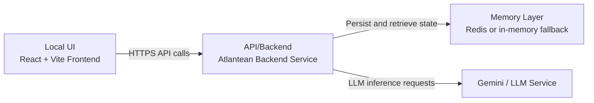

<div align="center">

</div>

# Run your AI Studio app locally

This contains everything you need to run your app locally.

View your app in AI Studio: https://ai.studio/apps/drive/12CDszUJAxwc5CBTjwFTX8IKXHZUgE5LY

## Project Focus

This repository is configured for local development and execution.

## Architecture Diagram



## Run Locally

**Prerequisites:**  Node.js


1. Install dependencies:
   `npm install`
2. Set `VITE_GEMINI_API_KEY` in [.env.local](.env.local) to your Gemini API key
3. Run the app:
   `npm run dev`

## Validation And Benchmarks

Run the full validation suite:

```bash
python tests/run_validation.py
```

Includes:
- HRM simulation tests
- Hot/cold memory persistence tests
- Sync conflict tests
- Stateless LLM enforcement tests

Run CPU batch training benchmark for HRM:

```bash
python benchmarks/hrm_cpu_batch_benchmark.py --batch-size 16 --steps 100 --epochs 3
```

## QUADRA Symbolic Governance Modules

New modules in `atlantean_core`:
- `symbolic_reasoner.py`
- `governance.py`
- `scheduler.py`

These modules are compute-gated and optional by design. They do not run continuously.

### Compute-Gating Controls

Set environment variables to enable and bound optional symbolic reasoning:

```bash
export QUADRA_SYMBOLIC_ENABLED=1
export QUADRA_SYMBOLIC_EVERY_N_QUERIES=25
export QUADRA_SYMBOLIC_MAX_COMPUTE_MS=6.0
export QUADRA_SYMBOLIC_BUDGET_MS_PER_MIN=120.0
export QUADRA_GOVERNANCE_WINDOW_SECONDS=60
export QUADRA_GOVERNANCE_MAX_INVOCATIONS=32
```

Defaults keep symbolic reasoning disabled unless explicitly enabled.

## Which GUI Is Running

This repo includes two separate UI surfaces:

1. React/Vite app (default for current stack)
   - URL: `http://localhost:3000`
   - Edit files in: `App.tsx`, `components/`, `hooks/`, `services/`
2. Flask demo GUI (separate legacy/demo surface)
   - URL: `http://localhost:5000`
   - Start with: `python gui.py`
   - Edit files in: `gui.py`, `templates/index.html`

If your GUI edits are not reflecting, confirm you are editing the files for the UI running on your active port.

## Security

### CORS Configuration

Both backends restrict cross-origin requests to whitelisted origins. See [CORS_CONFIG.md](CORS_CONFIG.md) for details on:
- Development setup (defaults to localhost)
- Production deployment (requires explicit `ALLOWED_ORIGINS` env var)
- Troubleshooting CORS errors

### API Key Security

The Gemini API key is:
- ✅ Stored server-side in `.env.local` (never exposed to browser)
- ✅ Used exclusively by backend servers
- ✅ Never injected into frontend builds

All browser requests route through `/api/atlantean/query` backend endpoint.

### Session Security (Production)

Before production start, set:
- `ATLANTEAN_SESSION_SECRET` to a strong random value
- `SESSION_COOKIE_SECURE=1` when running over HTTPS

Example:

```bash
export ATLANTEAN_SESSION_SECRET="$(openssl rand -hex 32)"
export SESSION_COOKIE_SECURE=1
```

